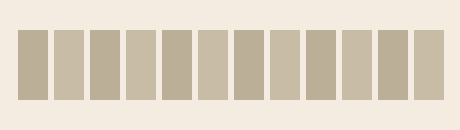

<h1 align="center">📚 shelf</h1>

<p align="center"><em>He says nothing. He shelves them.</em></p>

<p align="center">
  
  
  
  
  
</p>

---

<p align="center">
  <!-- generated animation (scripts/make-demo.mjs); swap for a real screen-recorded GIF if you make one -->
  
</p>

<p align="center"><strong>Your tab bar is a screaming row. He shelves it — quietly.</strong></p>

You know him. The old librarian. Glasses on a chain, finger to his lips, has known where every book lives since before you were born. You drop forty-seven open tabs on his desk in one screaming row. He says nothing. He shelves them.

**shelf** puts him inside your browser.

## Before / after

```
before  ▸ github · github · youtube · docs · jira · github · youtube · docs · …
                         (one long screaming row)

after   ▸ 🔵 Github (3)   🔴 Youtube (2)   🟢 Docs (2)   🟡 Jira
                  collapsed. quiet. shelved.
```

Every tab finds its shelf, by domain or by your own rules. Switch shelves and the
rest fold shut behind you (Focus Mode). No cloud, no account, no API key.

## Features

- **Auto-group by domain** — `github.com → Github`, deterministic colour per site, ccSLD-aware (`example.co.uk`, not `co.uk`).
- **Focus Mode** — collapse every group except the one you're working in.
- **Custom rules** — send `cnn.com` and `bbc.com` to one **News** shelf; rules override domains.
- **Duplicate detection** — badge counts duplicate tabs; close them all in one click, or auto-close on open.
- **Exceptions** — domains the librarian never touches.
- **Merge subdomains**, minimum-tabs-to-shelf, collapse-by-size — all optional.
- **Zero telemetry, zero network.** Everything happens locally in your browser.

## Install (Load unpacked)

1. Clone or download this folder.
2. Open `brave://extensions` (or `chrome://extensions`).
3. Turn on **Developer mode** (top-right).
4. Click **Load unpacked** and select this folder.
5. Open a pile of tabs, click the 📚 icon → **Shelve now**.

No build step. It's vanilla JavaScript — what you see is what runs.

## How he works

Before shelving a tab, the librarian asks, in order:

```
1. Is it a real page?        → no (chrome://, brave://): leave it alone
2. Does a rule claim it?     → yes: that shelf wins
3. Otherwise:                → shelve by domain, coloured by domain
```

Lazy, not careless: pinned tabs are never touched, exceptions are honoured, and he
never sends a single URL anywhere.

He shelves a tab **when you leave it**, never while you're reading it — so opening a
link never yanks the current tab out from under you into a faraway group.

## Shortcuts

Two optional keyboard shortcuts (defaults below — rebind at `brave://extensions/shortcuts`):

- **Shelve now** — `Ctrl+Shift+U`
- **Hush** (collapse all groups) — `Ctrl+Shift+E`

## Settings

Right-click the icon → **Options**, or the **Settings →** link in the popup. Toggle
Focus Mode, merge-subdomains, thresholds, edit rules and exceptions, tune duplicate
matching.

### He respects what you do by hand

shelf only shelves **loose** tabs (ones not already in a group). Groups you make,
name, or recolour yourself are never moved, renamed, or re-collapsed. Want a fixed
**name and colour** for a site? Add a **rule** (`domain → name → colour`) — shelf keeps
it stable. A manual rename *without* a rule isn't tracked, so new tabs of that domain
may start a fresh group; use a rule if you want them to keep merging.

## Roadmap

- **v2 — the librarian learns to read.** Optional semantic grouping by *topic* (not
  just domain) via a **local LLM through Ollama** — fully private, nothing leaves your
  machine. The grouping engine is already built around a `GroupingStrategy` interface
  (`lib/grouping.js`), so this drops in as one more strategy. Cloud providers
  (OpenAI/Claude) as an opt-in fallback.
- AI rule generation ("group my research tabs") and tab-search.
- **Firefox** — waiting on a stable `tabGroups` WebExtension API. shelf's grouping is
  built entirely on `chrome.tabGroups`, which Firefox doesn't expose yet; until it
  does, shelf is Chromium-only (Chrome · Brave · Edge).

## License

[MIT](LICENSE). The shortest license that holds.
